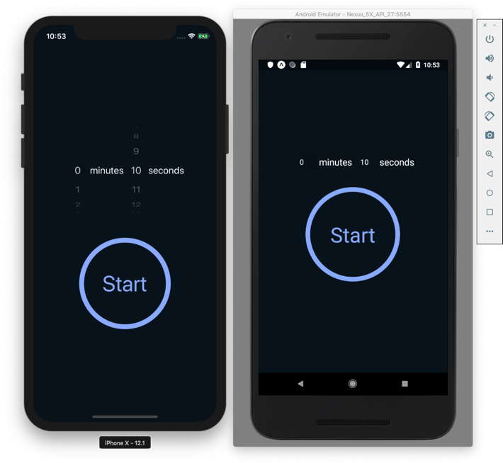

## React Native Timer App

### Features
- **Countdown Timer**: Set and start a countdown timer with minutes and seconds.
- **Picker Controls**: Use dropdown pickers to select minutes and seconds.
- **Start/Stop Timer**: Start the timer and stop it when needed.
- **Responsive Design**: Designed to work well on various screen sizes.

### Installation

- `git clone https://github.com/ReactNativeSchool/react-native-timer`
- `yarn install`/`npm install`

### Running

- `yarn run ios`/`npm run ios` or `yarn run android`/`npm run android`

---

